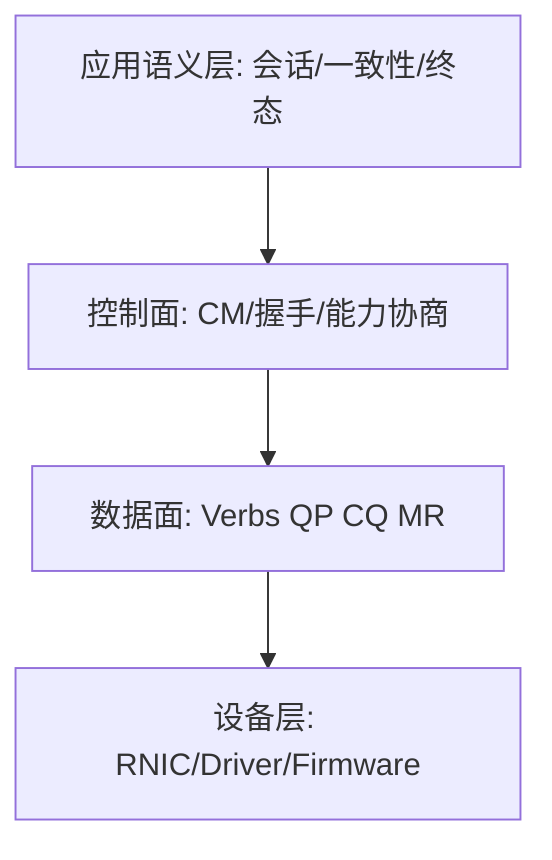
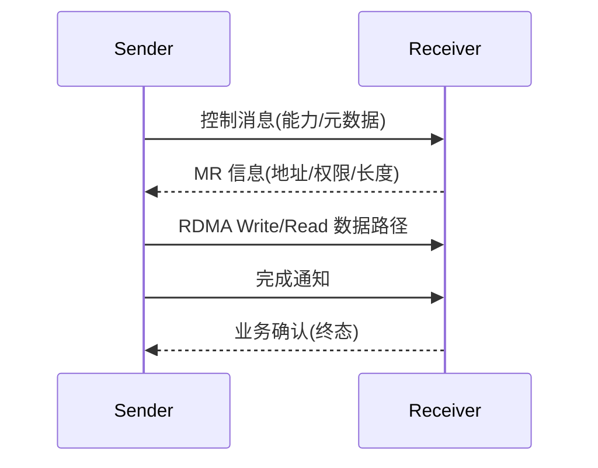
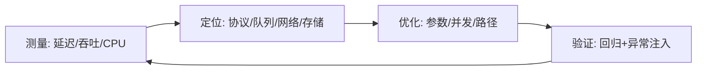

> 本文由 Codex Skill `project-blog-oneclick-publisher` 自动生成并自动发布。

## 目录
- [为什么 RDMA 会出现：来源与发展脉络](#为什么-rdma-会出现来源与发展脉络)
- [RDMA 解决的核心问题与适用边界](#rdma-解决的核心问题与适用边界)
- [RDMA 体系结构：从语义到实现](#rdma-体系结构从语义到实现)
- [图解 RDMA：分层、时序与性能闭环](#图解-rdma分层时序与性能闭环)
- [重点代码逻辑讲解](#重点代码逻辑讲解)
- [性能最优设计方法论](#性能最优设计方法论)
- [RDMA 最佳实践与常见反模式](#rdma-最佳实践与常见反模式)
- [开源生态：值得长期跟踪的项目](#开源生态值得长期跟踪的项目)
- [主流厂商与大规模应用方式](#主流厂商与大规模应用方式)
- [如何借鉴“官方文档目录法”构建知识体系](#如何借鉴官方文档目录法构建知识体系)
- [我的 demo 在知识体系里的位置](#我的-demo-在知识体系里的位置)
- [QA](#qa)
- [参考资料](#参考资料)

## 为什么 RDMA 会出现：来源与发展脉络

RDMA 的来源并不是“为了追求一个更快的 API”，而是为了应对传统网络 I/O 在高并发和大规模数据交换中的系统性开销：多次拷贝、频繁上下文切换、协议栈处理路径过长、CPU 在数据搬运上占比过高。随着 HPC、分布式存储、数据库内存化、AI 训练对节点间通信的要求持续上升，网络瓶颈从“带宽不足”逐渐演化为“端到端软件路径过重”。RDMA 的核心思想是把“远端内存可控访问”作为一等能力，尽可能绕过冗余软件路径，让数据搬运更接近硬件路径。

从标准和生态看，RDMA 不是单点技术，而是多条发展线共同演进。InfiniBand 把低延迟互连和 verbs 模型体系化；iWARP 试图复用 TCP 生态；RoCE 将 RDMA 语义映射到以太网并不断完善拥塞与无损机制；云厂商又在各自网络体系里做了工程化变体与驱动抽象。IETF 的 RDMAP（RFC 5040）从协议视角给出远端读写与内核旁路的基础定义，Linux 社区的 `rdma-core` 则把用户态库、驱动 provider 和工具链落到可实践的工程层。换句话说，RDMA 的发展不是“单一协议胜出”，而是“语义模型稳定 + 传输实现多样化”。

理解这一点很重要：你学习 RDMA 时，真正要掌握的是语义不变量，而不是某一代硬件或某个厂商工具。语义不变量包括：内存注册与授权、队列模型与完成语义、控制面与数据面分层、终态确认与异常回收。这些能力才是长期可迁移的知识资产。

## RDMA 解决的核心问题与适用边界

RDMA 主要解决三类问题。第一类是 CPU 占用问题：把数据搬运工作尽量交给网络设备，降低主机 CPU 在网络路径上的占比。第二类是延迟与抖动问题：减少协议路径层级和软件干预点，降低尾延迟。第三类是可扩展性问题：在节点规模扩展时，让通信成本增长更平滑。

但 RDMA 也有明确边界。它并不自动保证业务语义正确，应用仍需设计控制协议和终态确认；它并不天然适合所有业务，短连接高频小消息且无需极致性能的系统，收益可能不明显；它对网络和驱动环境更敏感，部署复杂度高于普通 TCP 栈。因此，正确问题不是“要不要用 RDMA”，而是“在什么负载模型与团队能力下，RDMA 的总收益为正”。

在系统设计上，RDMA 应该被视为“高性能能力集”，而非“全栈替换方案”。很多成功实践都采用混合架构：控制面继续用成熟协议（如 TCP/gRPC 等）承载复杂语义，数据面在关键路径启用 RDMA。这样做可以把性能收益和工程风险分开管理。

## RDMA 体系结构：从语义到实现

RDMA 的知识体系可以分为五层：

1. 概念层：为什么要远端内存访问，哪些语义与传统 socket 不同。
2. 机制层：PD/QP/CQ/MR、Send/Recv、Read/Write、CM 事件、完成队列。
3. 实现层：verbs API、rdma_cm、provider 驱动、用户态库与工具。
4. 验证层：基准测试、异常注入、错误码体系、可观测性。
5. 演进层：协议兼容、能力协商、跨硬件与跨云部署策略。

这五层之间是递进关系。概念层不清，机制层就会被误用；机制层不稳，实现层就会“能跑但不可解释”；没有验证层，性能优化会变成猜测；没有演进层，系统一升级就会出现不可控风险。真正的知识体系结构，不是堆术语，而是让每一层都有清晰输入输出。

一个高效学习顺序是：先掌握 verbs 与 CM 的职责边界，再理解完成语义与内存授权，最后看性能调优和大规模部署。反过来学通常会陷入参数调优细节，却解释不了系统为什么会失败。

## 图解 RDMA：分层、时序与性能闭环

### 图 1：RDMA 分层语义图

### 图 2：控制面与数据面时序

### 图 3：性能优化闭环

这三张图分别回答“是什么”“怎么走”“怎么优化”。很多文章只讲第二张时序图，读者容易会用但不会设计；只讲第一张分层图，读者容易会背概念但落不到实现；只讲第三张优化图，读者又会跳过语义前提。知识体系结构必须把三者连起来。

## 重点代码逻辑讲解

### 重点代码逻辑讲解 1：`rdma_wait_event` 的事件-状态一致性

在 `src/rdma_sim.c` 中，`rdma_wait_event` 的本质作用不是“阻塞等待一个事件”，而是“把状态机期望和 CM 事件做一致性绑定”。当系统进入某个阶段时，只允许消费该阶段合法事件，非法事件应尽快失败。这种设计可以显著降低错误扩散：如果事件错位在入口就被拦截，后续 QP/MR 操作不会在错误前提下继续推进。

知识要点在于“事件确认是协议动作的一部分”。如果开发者只拿事件而不做规范确认，系统在低负载下可能看似正常，高负载下却会积累难以解释的异常。很多 RDMA 初学 bug 都不是 API 参数错，而是状态语义错。

### 重点代码逻辑讲解 2：`rdma_build_qp` 的资源拓扑约束

`rdma_build_qp` 体现了 RDMA 资源不是平铺关系，而是拓扑关系：PD 是资源边界容器，QP 负责收发语义，CQ 负责完成可见性，completion channel 负责事件通知路径。任何一个对象配置不当，都可能在运行阶段变成“非局部故障”。

这里最容易被忽略的是容量参数与流量模型的耦合。`max_send_wr`、`max_recv_wr`、SGE 深度不是固定模板，而应来自对业务并发和消息模型的估计。参数“能跑”不等于“可持续”，规模上来后才暴露的问题往往都源于容量契约没被建模。

### 重点代码逻辑讲解 3：`rdma_register_mr` 的授权边界模型

MR 注册不仅是“让内存可访问”，更是“定义访问契约”。契约至少包括地址范围、长度范围、访问权限和生命周期。很多错误来自契约碎片化：地址正确但权限不足、权限正确但长度协商错误、长度正确但对象生命周期管理失败。把 MR 当作能力对象理解，比把它当作普通结构体更接近本质。

在安全层面，MR 模型天然支持最小授权原则：只开放必要范围，只授予必要能力，只在必要时间有效。这也是为什么 RDMA 能同时提供高性能和可控性，前提是应用层不偷懒。

### 重点代码逻辑讲解 4：`rdma_poll_cq` 的完成语义筛选

`rdma_poll_cq` 的关键不在轮询本身，而在完成语义筛选：CQ 中可能出现多个类型事件，应用必须按当前状态机需求筛选合法完成并推进流程。若把“任意完成”都当作当前阶段成功，系统会出现伪成功。

这段逻辑也反映了性能与复杂度取舍。轮询简化了教学和调试，但会消耗 CPU；事件驱动更省资源，但需要更严格的并发控制和错误处理。最佳方案不取决于信仰，而取决于负载模型、团队经验和可观测能力。

## 性能最优设计方法论

RDMA 性能优化可以归纳为四步法：测量、定位、优化、验证。测量阶段要分层采集指标，至少区分控制面耗时、数据面吞吐、尾延迟、CPU 占用。定位阶段要先识别瓶颈归属（队列深度、网络拥塞、接收端消费、NUMA 绑定等），再决定优化方向。优化阶段优先做单变量实验：块大小、in-flight WR 数、CQ 策略分别调参。验证阶段必须带回归和故障注入，确认优化没有破坏语义。

所谓“最优设计”不是固定参数，而是固定方法。你可以在不同硬件、不同云、不同驱动版本下复用这套方法，快速得到场景化最优解。没有方法论，优化就是偶然命中；有方法论，优化才可复现。

## RDMA 最佳实践与常见反模式

最佳实践：

1. 控制面与数据面分离，协议语义独立演进。
2. MR 能力对象化管理，统一生命周期回收。
3. 完成语义分层（设备完成、传输完成、业务确认）。
4. 先做正确性基线，再做性能增益。
5. 用结构化日志记录阶段、队列、错误码和会话 ID。

常见反模式：

1. 把 RDMA 当“更快 socket”，忽略授权与边界。
2. 只看平均延迟，不看尾延迟和重试行为。
3. benchmark 只跑成功路径，不测异常路径。
4. 版本升级无能力协商，靠“默认兼容”赌运气。
5. 优化只看吞吐，不看语义回归。

## 开源生态：值得长期跟踪的项目

- `linux-rdma/rdma-core`：Linux 用户态 RDMA 核心库和工具，是 verbs 与 rdma_cm 实践的基础。
- `OpenFabrics Alliance` 培训资料：面向 verbs 编程的系统化教学资源。
- `libfabric`：提供跨传输抽象，verbs/efa 等 provider 映射值得深入理解。
- `UCX`：HPC 与 AI 场景常用通信框架，对 RDMA 与多传输协同有大量工程经验。
- `NCCL + RDMA/SHARP plugin`：GPU 集群跨节点通信的重要实践路径。

这些项目共同说明一件事：RDMA 不是孤立库，而是完整生态。学习时建议“核心库 + 抽象层 + 上层框架”三线并行，避免陷入单点视角。

## 主流厂商与大规模应用方式

从公开文档看，主流厂商的应用路径有明显共性：

- 云厂商：把 RDMA 能力封装为实例网络能力，强调可部署性和运维接口。
- AI/HPC 厂商生态：把 RDMA 与集体通信、拓扑感知调度结合，追求大规模训练效率。
- 存储与数据库场景：把 RDMA 用于低延迟数据面，控制面继续使用成熟协议。

AWS EFA 文档展示了其与 Libfabric、MPI、NCCL 的整合路径；Azure HBv4 文档强调 NDR InfiniBand 在大规模 HPC 上的网络能力；Google Cloud 文档展示了 Cloud RDMA 在 AI/HPC 集群中的网络配置路径；NVIDIA 文档则更系统地给出了从架构到 API 的编程视角。不同厂商的落地方式不同，但共同目标都是“把 RDMA 能力工程化为可运营服务”。

## 如何借鉴“官方文档目录法”构建知识体系

你提到“参考最好的书或官网目录怎么讲技术”。这非常关键。以 NVIDIA RDMA Aware Programming 文档目录为例，它的组织方式是：架构总览 -> 编程总览 -> API 分层 -> 事件 -> 示例。IETF RFC 的目录方式是：术语 -> 架构目标 -> 协议语义 -> 错误与安全 -> 兼容。云厂商文档通常是：能力概览 -> 前置条件 -> 部署步骤 -> 限制 -> 监控与排障。

一个高质量技术长文可以直接借鉴这种目录法：

1. 先定义术语和边界。
2. 再给体系结构和语义路径。
3. 再落到实现与优化。
4. 再给部署限制和反模式。
5. 最后给 QA 与参考材料。

这比“按写代码顺序讲”更容易形成知识网络，也更适合读者按需跳读。

## 我的 demo 在知识体系里的位置

你的 `rdma-learn` 项目定位非常清楚：它不是完整产品，而是“最简单上手 demo”。这个定位是对的。它的价值是让读者用最小成本建立 RDMA 的第一性理解：控制面如何协商，数据面如何搬运，完成语义如何闭环。只要读者建立了这三件事，后续学习任何 RDMA 框架都更快。

因此，demo 不需要承担“大而全”。它需要承担的是“概念正确、边界清晰、可验证”。把 demo 当知识入口，而不是当功能终点，这样你后续扩展到 UCX、libfabric、NCCL、NVMe-oF 等方向时，会自然形成体系，而不是重复堆代码。

## QA

### Q1：RDMA 学习者最容易走偏的地方是什么？
### A1：最容易走偏的是把重点放在 API 顺序而不是语义模型。API 顺序可以复制，语义模型必须理解。比如你知道 `post_send` 怎么调用，不代表你理解什么时候应该等待哪类 completion；你知道怎么注册 MR，不代表你理解授权边界与生命周期。建议每次看代码都先问“这个动作新增了什么保证、依赖什么前提、失败会破坏什么不变式”。能回答这三个问题，说明进入了系统理解层。

### Q2：什么时候不该优先上 RDMA？
### A2：当系统瓶颈不在网络数据面、团队缺乏基本可观测性、或者业务复杂度主要在控制逻辑而非数据搬运时，不应优先上 RDMA。RDMA 提升的是关键数据路径效率，不会自动解决业务语义复杂度。若直接引入会增加运维和调试成本，收益可能被复杂度抵消。正确做法是先做瓶颈分层分析，再决定是否在局部路径启用。

### Q3：如何判断一个 RDMA 方案是否具备长期演进能力？
### A3：看四件事：是否有协议版本与能力协商；是否有结构化错误码与回收策略；是否有跨环境可复现基准；是否把语义回归纳入优化流程。满足这四项，说明方案具备“变化中的稳定性”；否则通常只能在当前环境“跑得过去”，一升级就脆弱。

## 参考资料

- NVIDIA RDMA Aware Programming User Manual: https://docs.nvidia.com/networking/display/RDMAAwareProgrammingv17
- Linux rdma-core: https://github.com/linux-rdma/rdma-core
- RFC 5040 (RDMAP): https://www.rfc-editor.org/rfc/rfc5040
- OpenFabrics RDMA Training: https://www.openfabrics.org/training/
- AWS EFA: https://docs.aws.amazon.com/AWSEC2/latest/UserGuide/efa.html
- Azure HBv4: https://learn.microsoft.com/en-us/azure/virtual-machines/hbv4-series-overview
- Google Cloud RDMA: https://docs.cloud.google.com/compute/docs/instances/create-vm-with-rdma
- NVMe over RDMA Transport: https://nvmexpress.org/specification/rdma-transport-specification/
- NCCL RDMA SHARP Plugins: https://docs.nvidia.com/networking/display/hpcvx225/nccl-rdma-sharp-plugins
